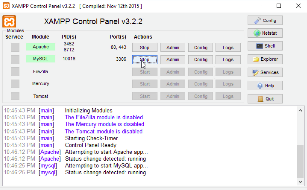

# Group-chat
You can chat with peoples who are all available in the group.

# Preinstallation
1. Install XAMPP web server
2. Any Editor (Preferably VS Code or Sublime Text)
3. Any web browser with latest version

# Languages and Technologies used.
1. HTML5/CSS3
2. JavaScript 
3. Bootstrap (An HTML, CSS, and JS library)
4. XAMPP (A web server by Apache Friends)
5. Php
6. MySQL 

# Steps to run the project in your system.
1. Download and install XAMPP in your machine
2. Clone or download the repository
3. Extract all the files and move it to the 'htdocs' folder of your XAMPP directory.
4. Start the Apache and Mysql in your XAMPP control panel.
5. Open your web browser and type 'localhost/phpmyadmin'
6. In phpmyadmin page, create a new database from the left panel and name it as 'login'
7. Import the file 'posts1.sql' inside your newly created database and click ok.
8. Open a new tab and type 'localhost/foldername' in the url of your browser.
9. Now,You can run the project.

# SOFTWARES USED
1. XAMPP was installed. APACHE2 Server and MySQL were initialized. And, files were built inside opt/lampp/htdocs/myhmsp
2. Brackets was used as a text editor.
3. Google Chrome was used to run the project (localhost/groupchat was used as the url).

# Starting Apache And MySQL in XAMPP:
The XAMPP Control Panel allows you to manually start and stop Apache and MySQL. To start Apache or MySQL manually, click the ‘Start’ button under ‘Actions’.

